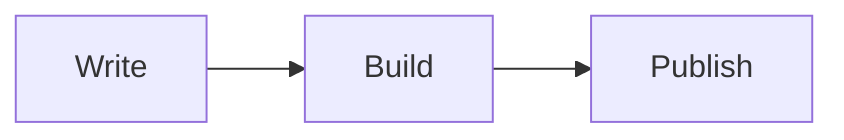

# Blog

Personal blog and portfolio of [Lluciocc](https://lluciocc.fr).

The visual design of this blog was inspired by [boidushya/blog.boidu.dev](https://github.com/boidushya/blog.boidu.dev). The original experience was converted to Vite, React, and TypeScript so the project does not depend on Next.js. The same core features are preserved, with an enhanced Markdown publishing pipeline.

## Features

- Responsive blog and portfolio interface with themes.
- Static Markdown and MDX articles generated at build time.
- Likes, signatures, image comparisons, SEO metadata, and sitemap generation.
- Syntax-highlighted code blocks with copy buttons.
- Full CommonMark/GFM support: headings, tables, task lists, nested lists, footnotes, alerts, images, links, blockquotes, and more.
- Mermaid diagrams and KaTeX mathematics.
- Trusted raw HTML for elements such as `details`, `summary`, `kbd`, `audio`, `video`, and `iframe`.

## Getting started

```bash
npm install
cp .env.example .env
npm run dev
```

The development server is available at `http://localhost:{port}`.

## Writing an article

Add a `.md` or `.mdx` file to `src/content/blog/`:

```yaml
---
title: "My article"
slug: "my-article"
date: "2026-08-17"
description: "A short description used for SEO."
banner: "/images/article-cover.jpg"
labels: ["Notes"]
authors: ["Lluciocc", "Jane Doe"]
draft: false
---
```

Authors may also define avatars:

```yaml
authors:
  - name: "Lluciocc"
    logo: "/profile.png"
  - name: "Jane Doe"
    logo: "/authors/jane.jpg"
```

Articles with `draft: true` are available during development but hidden from production.

### Markdown extensions

Use a fenced `mermaid` block for diagrams:

````markdown

````

Use `$...$` for inline mathematics and `$$...$$` for display mathematics. GitHub alerts such as `> [!NOTE]` and `> [!WARNING]` are also supported. The development-only `/blog/markdown-showcase` article demonstrates the supported syntax.

Raw HTML is intended for repository-owned content only. Do not send untrusted user input through the content generator.

## Environment

Copy `.env.example` to `.env` and configure the following variables when needed:

```bash
VITE_SITE_URL=
VITE_SUPABASE_URL=
VITE_SUPABASE_ANON_KEY=
```

Supabase powers likes and signatures. The site remains browsable without Supabase configuration, but those dynamic interactions are disabled. Never expose a Supabase `service_role` key in the frontend.

## Deployment

Run `npm run build` and deploy the generated `dist/` directory to any static hosting provider such as Vercel, Netlify, or Cloudflare Pages. Configure the host to serve `index.html` as the SPA fallback for routes such as `/blog/my-article`.

## License

This project is distributed under the [GNU General Public License v3.0](LICENSE).
